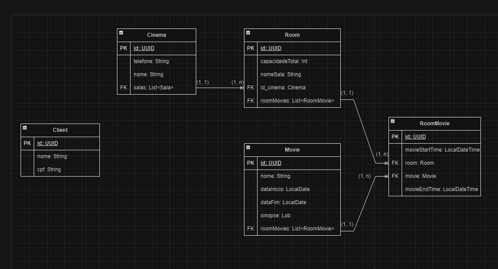

# Venda ingressos

Um projeto de microserviço simulando um cinema tendo venda de ingressos

## SWAGGER

Para utilizar o swager, basta utilizar essa url http://localhost:8080/swagger-ui/index.html

## API Reference

#### Post cadastrando client.

```http
  POST /clients
```

| Parameter         | Type     | Description                   |
|:------------------|:---------|:------------------------------|
| `name`            | `String` | **Required**. Nome do cliente |
| `cpf`             | `String` | **Required**. CPF do cliente  |

#### Get que busca todos os clients já cadastrados, de acordo com a quantidade passada.

```http
  GET /clients
```
| Parameter | Type   | Description                                                                              |
|:----------|:-------|:-----------------------------------------------------------------------------------------|
| `size`    | `Int`  | **Required**. Quantidade de clients que irá trazer.                                      |
| `offset`  | `Int` | **Required**. Qual a pagina que vai estar, ex: 10 clients pagina 1, 10 clients pagina 2. |

#### Put que edita todos os dados do client.

```http
  PUT /clients
```

| Parameter | Type   | Description                                                                          |
|:----------|:-------|:-------------------------------------------------------------------------------------|
| `name`            | `String` | **Required**. Nome do cliente |
| `cpf`             | `String` | **Required**. CPF do cliente  |

#### Delete para deletar o client de acordo com o id passado.

```http
  DELETE /clients/{id}
```

| Parameter | Type   | Description                                |
|:----------|:-------|:-------------------------------------------|
| `id`      | `UUID` | **Required**. Numero de cadastro do client |

#### Post cadastra o cinema.

```http
  POST /cinemas
```

| Parameter          | Type     | Description                       |
|:-------------------|:---------|:----------------------------------|
| `name`             | `String` | **Required**. Nome do cinema.     |
| `phone`            | `String` | **Required**. Telefone do cinema. |

#### Get que busca todos os cinemas já cadastradas.

```http
  GET /cinemas
```

| Parameter | Type   | Description                                                                              |
|:----------|:-------|:-----------------------------------------------------------------------------------------|
| `size`    | `Int`  | **Required**. Quantidade de cinemas que irá trazer.                                      |
| `offset`  | `Int` | **Required**. Qual a pagina que vai estar, ex: 10 cinemas pagina 1, 10 cinemas pagina 2. |

#### Delete para deletar o cinema de acordo com o id passado.

```http
  DELETE /cinemas/{id}
```

| Parameter | Type   | Description                                |
|:----------|:-------|:-------------------------------------------|
| `id`      | `UUID` | **Required**. Numero de cadastro do cinema |

#### Post cadastra o movie.

```http
  POST /movies
```

| Parameter          | Type        | Description                                                      |
|:-------------------|:------------|:-----------------------------------------------------------------|
| `name`             | `String`    | **Required**. Nome do filme.                                     |
| `startDate`            | `LocalDate` | **Required**. Data que o filme irá estreiar, ex: 20/05/2025.     |
| `endDate`            | `LocalDate`    | **Required**. Data que o filme irá ser retirado, ex: 20/06/2025. |
| `synopsis`            | `String`    | **Required**. Sinopse do filme.                                  |

#### Get que busca todos os movies já cadastradas.

```http
  GET /movies
```

| Parameter | Type   | Description                                                                            |
|:----------|:-------|:---------------------------------------------------------------------------------------|
| `size`    | `Int`  | **Required**. Quantidade de filmes que irá trazer.                                     |
| `offset`  | `Int` | **Required**. Qual a pagina que vai estar, ex: 10 filmes pagina 1, 10 filmes pagina 2. |

#### Delete para deletar o movie de acordo com o id passado.

```http
  DELETE /movies/{id}
```

| Parameter | Type   | Description                               |
|:----------|:-------|:------------------------------------------|
| `id`      | `UUID` | **Required**. Numero de cadastro do filme |

#### Post cadastra a sala em que o filme será exibido.

```http
  POST /rooms
```

| Parameter          | Type     | Description                                                                |
|:-------------------|:---------|:---------------------------------------------------------------------------|
| `totalCapacity`       | `Int`    | **Required**. Capacidade total de pessoas na sala.                         |
| `roomName`            | `String` | **Required**. Nome da sala.                                                |
| `idCinema`            | `UUID`   | **Required**. Numero de identificação do cinema em que se encontra a sala. |

#### Get que busca todos as salas já cadastradas.

```http
  GET /rooms
```

| Parameter | Type   | Description                                                                          |
|:----------|:-------|:-------------------------------------------------------------------------------------|
| `size`    | `Int`  | **Required**. Quantidade de salas que irá trazer.                                    |
| `offset`  | `Int` | **Required**. Qual a pagina que vai estar, ex: 10 salas pagina 1, 10 salas pagina 2. |

#### Delete para deletar a sala de acordo com o id passado.

```http
  DELETE /rooms/{id}
```

| Parameter | Type   | Description                              |
|:----------|:-------|:-----------------------------------------|
| `id`      | `UUID` | **Required**. Numero de cadastro da sala |

#### Post para cadastrar o horário de inicio e fim de cada filme em sua sala de exibição.

```http
  POST /room_movies
```

| Parameter          | Type     | Description                                                                |
|:-------------------|:---------|:---------------------------------------------------------------------------|
| `movieStartTime`       | `LocalDateTime`    | **Required**. Data e horário de inicio do filme.                           |
| `movieEndTime`         | `LocalDateTime` | **Required**. Data e horário de fim do filme.                              |
| `idRoom`            | `UUID`   | **Required**. Numero de identificação da sala em que o filme será exibido. |
| `idMovie`            | `UUID`   | **Required**. Numero de identificação do filme que será exibido.           |

#### Get que busca todos os horarios de cada filme cadastrado.

```http
  GET /room_movies
```

| Parameter | Type   | Description                                                                          |
|:----------|:-------|:-------------------------------------------------------------------------------------|
| `size`    | `Int`  | **Required**. Quantidade de room_movies que irá trazer.                              |
| `offset`  | `Int` | **Required**. Qual a pagina que vai estar, ex: 10 room_movies pagina 1, 10 room_movies pagina 2. |

#### Delete para deletar o algum horário de acordo com o id passado.

```http
  DELETE /room_movies/{id}
```

| Parameter | Type   | Description                                    |
|:----------|:-------|:-----------------------------------------------|
| `id`      | `UUID` | **Required**. Numero de cadastro do room_movie |

## DER


## Installation

Para utilizar o projeto, deverá ter o kafka instalado na maquina: [Download](https://kafka.apache.org/downloads)

Após instalar o kafka, suba o zookeeper e o kafka utilizando os seguintes comandos no TERMINAL do windows.

Iniciando o zookeeper
```bash
  zookeeper-server-start.bat C:\kafka\config\zookeeper.properties
```
Iniciando o kafka
```bash
  kafka-server-start.bat C:\kafka\config\server.properties
```
Após essas etapas, crie um tópico com o nome 'venda-ingressos-teste'

Criação do tópico
```bash
  kafka-topics.bat --bootstrap-server localhost:9092 --create --topic venda-ingressos
```